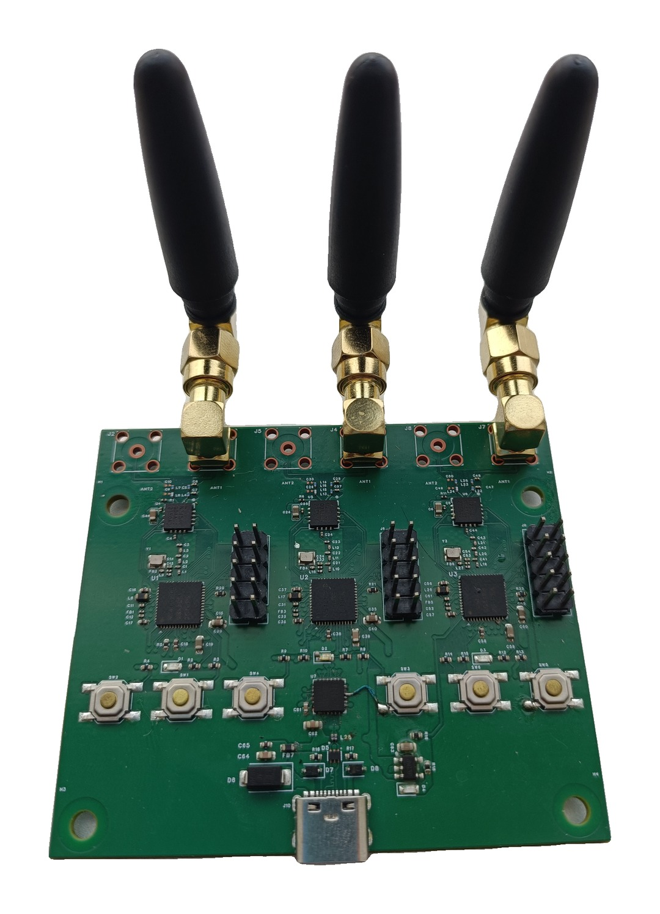
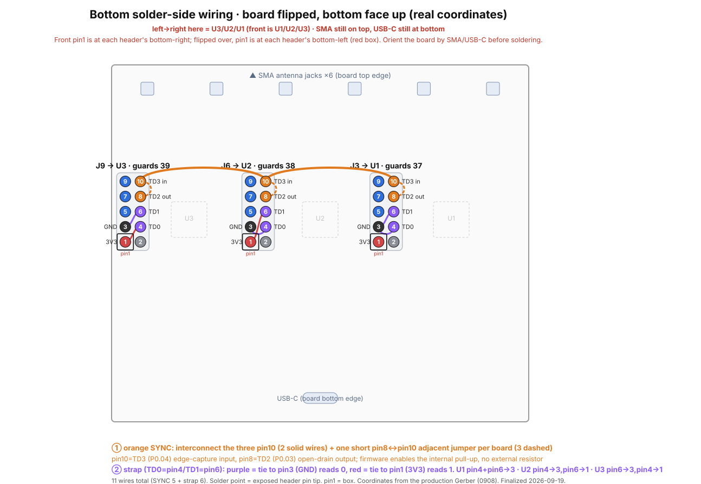
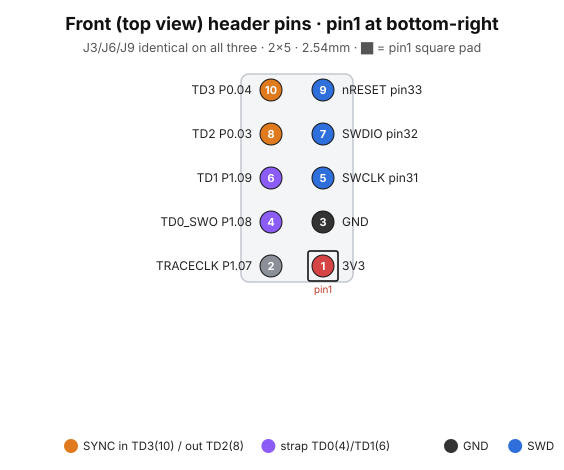

> **English** | [中文](README.zh-CN.md)

# BLEhound hardware — V1 (first fabricated board)

**V1 is the first — and so far only — fabricated batch** of the BLEhound board:
3× **nRF54LM20A** + **nRF21540** FEM, made via JLCEDA / JLCPCB (project date
2026-09-08). Everything in this folder describes that exact fabricated board.

<div align="center">



<sub>The fabricated V1 board — three synchronized nodes (channels 37 / 38 / 39), USB-C host.</sub>

</div>

> ⚠️ **The as-fabricated V1 has two known pin-level defects** (see Known issues,
> below) that break **three-board** mode. **Single-board sniffing works.** Do **not**
> expect a plain V1 — or the unfinished [`../v2-wip/`](../v2-wip/) — to work in
> three-board mode out of the box. For working three-board hardware, **wait for the V2
> revision** (routing not yet finished) or use a **reworked V1** (the flying-wire
> fixes below applied, or a modified V1 unit). These files are the design / fab
> reference and the basis for V2.

## Contents

| Path | What |
|---|---|
| `gerbers/` | Fabrication Gerbers (zip), as sent to the PCB house for the V1 board |
| `bom.csv` | Bill of materials (designator / value / footprint / qty) |
| `pick-and-place/` | Component placement file for SMT assembly |
| `assembly.pdf` | Assembly drawing (soldering aid) |
| `jlceda-source/` | The design source (see below) |

### Design source (`jlceda-source/`)

The authoritative V1 design is the JLCEDA (EasyEDA) Pro project:

- `ProPrj_BLEhound_2026-09-08.epro2` — **source of truth**, the fabricated
  V1 project (JLCEDA Pro V3 format). Open it in JLCEDA Pro to view/edit the schematic
  and layout.
- `ProPrj_BLEhound_0908_2026-09-18.epro` — the **same** project in the older
  `.epro` format, which is the one KiCad can import.

> Note: the files were renamed to `BLEhound` for this release. The project's
> **internal** name inside JLCEDA still reads `OpenSnifferDongle` (the pre-rename fab
> name); that internal label can only be changed from within JLCEDA Pro.

## Rebuilding the board

Send `gerbers/` to a PCB fab (JLCPCB, PCBWay, …); provide `bom.csv` and
`pick-and-place/` for assembly. Confirm the RF matching network against the
nRF54LM20A / nRF21540 reference designs before ordering.

## USB hub (CH334F) — strap configuration

The three SoCs' USB lines are combined onto the single USB-C port by **U7, a CH334F
4-port USB 2.0 hub** (WCH). Two of its strap pins must be wired exactly as below on
this board — get either wrong and the hub will not enumerate:

- **Internal oscillator — XI (pin 4) tied to GND.** The CH334F runs on its built-in
  oscillator, so the hub has **no external 12 MHz crystal** (none is in the BOM). To
  select the internal clock, **XI (pin 4) is grounded** and XO (pin 3) is left open.
  (The Y1–Y3 32 MHz crystals in the BOM belong to the nRF54LM20A SoCs, not the hub.)
- **Bus-powered — PSELF (pin 18) must float, never GND.** The dongle draws power from
  the USB-C host (bus-powered). For bus-powered operation **PSELF (pin 18) must be left
  floating; it must not be tied to GND.** Grounding PSELF selects self-powered mode and
  makes the hub misreport its power state to the host, breaking bus-powered
  enumeration. Leave pin 18 unconnected.

## Getting a KiCad version

KiCad's EasyEDA/JLCEDA Pro importer is **GUI-only** (`kicad-cli` cannot do it). To get
a KiCad project of V1:

1. KiCad → **File → Import → Non-KiCad Project → EasyEDA (JLCEDA) Pro Project…**
2. Select `jlceda-source/ProPrj_BLEhound_0908_2026-09-18.epro`.
3. Choose an output directory.

(The `.epro2` is used for offline diff/verification, not for import.)

---

## Known issues — first-batch rework (three-board mode)

The first fabricated batch has **two pin-level design errors** that block the
**three-board synchronized** mode. **Single-board sniffing is unaffected and works out
of the box.** Both are fixable with flying wires on the SWD debug headers — no PCB
respin, no touching SoC pads.

**1. SYNC line on P2.01 — the only port without GPIOTE.**
On the nRF54LM20A, port P2 is the single GPIO port with no GPIOTE instance, so it
cannot do edge capture / interrupts. The SYNC line was routed to P2.01, so the shared
time-base capture never works; firmware logs `sync_line: configure SYNC interrupt
failed: -134` (`-ENOTSUP`). Without SYNC, the three boards cannot be time-aligned.

**2. Strap wiring assigns wrong board roles.**
The per-board strap wiring makes two boards read the same role and the mapping is
offset, so no board ends up guarding advertising channel 37. Channel-guard assignment
is broken.

### Flying-wire rework (11 wires on J3/J6/J9)

**Front, top view** — solder from the top per this diagram:


**Board flipped, bottom (solder) view** — the same wiring from underneath:



<details><summary>2×5 header pin reference (pin1 at bottom-right)</summary>



</details>

The needed signals are all brought out to the 2×5 SWD debug headers (J3=U1, J6=U2,
J9=U3) and land on P0/P1 pins that **do** have GPIOTE. Reassignment:

| Header pin | Signal | Ball | Role |
|---|---|---|---|
| 10 | SYNC input (edge capture) | P0.04 | shared time base in |
| 8 | SYNC output (open-drain, no GPIOTE) | P0.03 | shared time base out |
| 6 | strap1 | P1.09 | board-role bit 1 |
| 4 | strap0 | P1.08 | board-role bit 0 |

```
Current firmware pin map — SWD/debug header J3/J6/J9 (PinHeader 2x05, 2.54 mm)

  odd column (SWD)         even column (trace pins -> tri-sync / tri-strap)
  [1]  3V3                 [2]   -
  [3]  GND                 [4]   TD0  strap0   P1.08   (role bit S0)
  [5]  SWCLK               [6]   TD1  strap1   P1.09   (role bit S1)
  [7]  SWDIO               [8]   TD2  SYNC-out  P0.03  (open-drain drive-low, NO GPIOTE)
  [9]  nRESET              [10]  TD3  SYNC-in   P0.04  (edge capture, internal pull-up)


Flying wires (11) — bottom view (board flipped: SMA on top / USB-C on bottom),
so left -> right reads U3(J9) / U2(J6) / U1(J3)

                       U3 / J9 (ch39)      U2 / J6 (ch38)      U1 / J3 (ch37)
  SYNC pin10 bus   ●━━━━━ pin10 ━━━━━━━━━━━━ pin10 ━━━━━━━━━━━━ pin10 ●     2 solid
  SYNC jumper            8┄┄10               8┄┄10               8┄┄10      3 dashed (pin8<->pin10)
  strap0  pin4  ->     3V3  (S0=1)         GND  (S0=0)         GND  (S0=0)
  strap1  pin6  ->     GND  (S1=0)         3V3  (S1=1)         GND  (S1=0)
  ─────────────────────────────────────────────────────────────────────────
  strap code S1S0        01                  10                  00
  board_id / channel     id2 / ch39          id1 / ch38          id0 / ch37

  ● wired pin   ○/open-drain out   ━ solid = SYNC bus   ┄ dashed = pin8-pin10 jumper
  strap: tie pin4/pin6 to pin1 (3V3) = read 1, to pin3 (GND) = read 0
  not fly-wired -> both straps read 1 (code 11, reserved) -> fallback id0/ch37
     (all three guard 37: degenerates to single-board, still captures)
```

- **SYNC bus (2):** `J3.10 ↔ J6.10`, `J6.10 ↔ J9.10`.
- **SYNC jumper (3):** on each board `pin8 ↔ pin10` (adjacent pins).
- **Strap (6):** `code = (strap1<<1)|strap0`; tie to pin3 (GND) = 0, to pin1 (3V3) = 1.
  - J3/U1 (role A, 00, guards 37): `pin4→pin3`, `pin6→pin3`
  - J6/U2 (role B, 10, guards 38): `pin4→pin3`, `pin6→pin1`
  - J9/U3 (role C, 01, guards 39): `pin6→pin3`, `pin4→pin1`

Firmware runs a boot self-test (drive pin8 low, expect pin10 low) and prints a SYNC
loopback-OK line when the jumpers are in place.

> These two fixes (SYNC → P0.04/P0.03, straps → P1.08/P1.09), plus dedicated
> inter-board SPI pins, FEM SPI relocation, and USB-hub self-power, are what the
> **V2 revision** ([`../v2-wip/`](../v2-wip/)) integrates directly into the PCB so no
> flying wires are needed — once its routing is finished.
