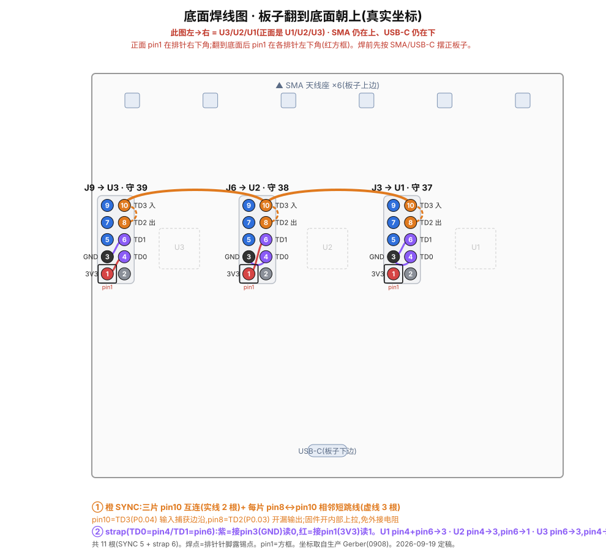
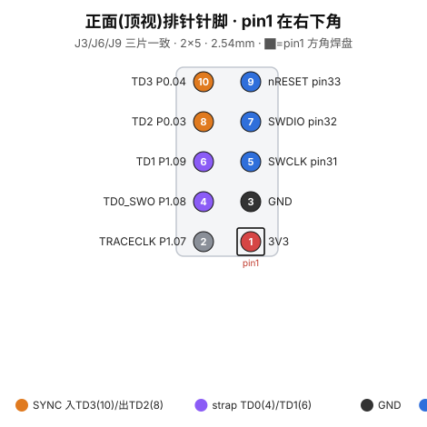

> [English](README.md) | **中文**

# BLEhound 硬件 —— V1(首批投产板)

**V1 是首批、也是目前唯一投产的板子:** BLEhound 板,3× **nRF54LM20A** + **nRF21540** FEM,经嘉立创 EDA / JLCPCB 投产(工程日期 2026-09-08)。本文件夹里的一切都对应这块实产板。

> ⚠️ **原始 V1 有两处已知引脚级缺陷**(见下方「已知问题」),会破坏**三机**模式。**单片抓包正常。** 不要指望原始 V1——或未完成的 [`../v2-wip/`](../v2-wip/)——开箱就能跑三机。想要可用的三机硬件,只能**等 V2 改版**(布线尚未完成),或用**改过的 V1**(按下方飞线修正返工过、或购入已修改的 V1 单元)。这些文件是设计 / 生产参考,也是 V2 的基础。

## 内容

| 路径 | 说明 |
|---|---|
| `gerbers/` | 制造 Gerber(zip),即当初交给 PCB 厂做 V1 板用的那份 |
| `bom.csv` | 物料清单(位号 / 值 / 封装 / 数量) |
| `pick-and-place/` | SMT 贴片坐标文件 |
| `assembly.pdf` | 装配图(焊接辅助) |
| `jlceda-source/` | 设计源(见下) |

### 设计源(`jlceda-source/`)

V1 的权威设计是嘉立创 EDA(EasyEDA)专业版工程:

- `ProPrj_BLEhound_2026-09-08.epro2` —— **真理源**,实产 V1 工程(嘉立创专业版 V3 格式)。在嘉立创专业版里打开可看/改原理图与 PCB。
- `ProPrj_BLEhound_0908_2026-09-18.epro` —— **同一**工程的旧版 `.epro` 格式,这是 KiCad 能导入的那种。

> 注:本次发布已把文件重命名为 `BLEhound`。工程在 JLCEDA 里的**内部**名称仍是 `OpenSnifferDongle`(改名前的投产名),该内部名称只能在嘉立创专业版里改。

## 复制这块板

把 `gerbers/` 发给 PCB 厂(JLCPCB、PCBWay 等);贴片提供 `bom.csv` 与 `pick-and-place/`。下单前对照 nRF54LM20A / nRF21540 参考设计核对射频匹配网络。

## USB hub(CH334F)—— strap 配置

三颗 SoC 的 USB 通过 **U7(CH334F,4 口 USB 2.0 集线器,沁恒 WCH)** 汇到同一个 USB-C 口。这颗芯片有两个配置脚在本板上必须按下面接——接错任一个 hub 都无法枚举:

- **内部晶振 —— XI(4 脚)接地。** CH334F 用片内振荡器,所以 hub **不外挂 12 MHz 晶振**(BOM 里也没有)。要选内部时钟,就把 **XI(4 脚)接地**、XO(3 脚)悬空。(BOM 里的 Y1–Y3 32 MHz 晶振是给 nRF54LM20A 的,不是给 hub 的。)
- **USB 总线供电 —— PSELF(18 脚)必须悬空,绝不能接地。** 本 dongle 由 USB-C 主机供电(总线供电)。总线供电模式下 **PSELF(18 脚)必须悬空,不能接 GND。** 把 PSELF 接地会让 hub 进入自供电模式、并向主机误报供电状态,导致总线供电下枚举失败。18 脚保持不连接。

## 拿到 KiCad 版本

KiCad 的 EasyEDA / 嘉立创专业版导入器是 **GUI 专属**(`kicad-cli` 做不了)。要得到 V1 的 KiCad 工程:

1. KiCad → **文件 → 导入 → 非 KiCad 工程 → EasyEDA (JLCEDA) Pro Project…**
2. 选 `jlceda-source/ProPrj_BLEhound_0908_2026-09-18.epro`。
3. 指定一个输出目录。

(`.epro2` 用于离线比对/核验,不用于导入。)

---

## 已知问题 —— 首批板返工(仅影响三机模式)

首批投产板有**两处引脚级设计错误**,卡住**三机同步**模式。**单片抓包不受影响,开箱即用。** 两处都能用调试排针飞线解决——不重打样、不碰 SoC 焊盘。

**1. SYNC 落在 P2.01 —— 全芯片唯一没有 GPIOTE 的口。**
nRF54LM20A 上 P2 是唯一没有 GPIOTE 实例的 GPIO 口,做不了边沿捕获/中断。SYNC 线偏偏走到了 P2.01,于是共享时基捕获从来不工作;固件报 `sync_line: 配置 SYNC 中断失败: -134`(`-ENOTSUP`)。没有 SYNC,三片无法对齐时基。

**2. strap 接法把板角色分错。**
各片 strap 接法让两片读到同一角色、且整体映射错位,导致没有一片守广播信道 37,信道分工失效。

### 飞线返工(J3/J6/J9 共 11 根)

**正面俯视** —— 从顶面焊照此图:


**翻到底面(焊接面)** —— 同样的接线从底面看:



<details><summary>2×5 排针针脚参考(pin1 在右下角)</summary>



</details>

要用的信号都引到了 2×5 SWD 调试排针(J3=U1、J6=U2、J9=U3),且落在**有** GPIOTE 的 P0/P1 脚上。重新分配:

| 排针 pin | 信号 | 球位 | 用途 |
|---|---|---|---|
| 10 | SYNC 输入(边沿捕获) | P0.04 | 共享时基 入 |
| 8 | SYNC 输出(开漏,不挂 GPIOTE) | P0.03 | 共享时基 出 |
| 6 | strap1 | P1.09 | 板角色 bit 1 |
| 4 | strap0 | P1.08 | 板角色 bit 0 |

```
当前固件引脚图 —— SWD/调试排针 J3/J6/J9(PinHeader 2x05, 2.54 mm)

  奇数列(SWD)             偶数列(trace 脚 -> tri-sync / tri-strap)
  [1]  3V3                 [2]   -
  [3]  GND                 [4]   TD0  strap0   P1.08   (角色位 S0)
  [5]  SWCLK               [6]   TD1  strap1   P1.09   (角色位 S1)
  [7]  SWDIO               [8]   TD2  SYNC-out  P0.03  (开漏驱低,不挂 GPIOTE)
  [9]  nRESET              [10]  TD3  SYNC-in   P0.04  (边沿捕获,内部上拉)


飞线(11 根)—— 底面视图(板翻到底面朝上:SMA 在上 / USB-C 在下),
所以左 -> 右 = U3(J9) / U2(J6) / U1(J3)

                       U3 / J9(守39)       U2 / J6(守38)       U1 / J3(守37)
  SYNC pin10 总线  ●━━━━━ pin10 ━━━━━━━━━━━━ pin10 ━━━━━━━━━━━━ pin10 ●     实线 2 根
  SYNC 跳线              8┄┄10               8┄┄10               8┄┄10      虚线 3 根(pin8<->pin10)
  strap0  pin4  ->     3V3 (S0=1)          GND (S0=0)          GND (S0=0)
  strap1  pin6  ->     GND (S1=0)          3V3 (S1=1)          GND (S1=0)
  ─────────────────────────────────────────────────────────────────────────
  strap 码 S1S0          01                  10                  00
  board_id / 守信道      id2 / 守39          id1 / 守38          id0 / 守37

  ● 已接脚   ○ 开漏输出   ━ 实线=SYNC 总线   ┄ 虚线=pin8-pin10 跳线
  strap:pin4/pin6 接 pin1(3V3)读 1,接 pin3(GND)读 0
  未飞线 -> 两 strap 都读 1(码 11,保留)-> 回落 id0/守37
     (三片都守 37:退化为单片,仍能抓包)
```

- **SYNC 总线(2 根):** `J3.10 ↔ J6.10`、`J6.10 ↔ J9.10`。
- **SYNC 跳线(3 根):** 每片 `pin8 ↔ pin10`(相邻两脚)。
- **strap(6 根):** `code = (strap1<<1)|strap0`;接 pin3(GND)读 0,接 pin1(3V3)读 1。
  - J3/U1(角色 A,00,守 37):`pin4→pin3`、`pin6→pin3`
  - J6/U2(角色 B,10,守 38):`pin4→pin3`、`pin6→pin1`
  - J9/U3(角色 C,01,守 39):`pin6→pin3`、`pin4→pin1`

固件开机会做回环自检(驱低 pin8,pin10 应读到低),跳线到位时打印 SYNC 回环通过。

> 这两处修正(SYNC → P0.04/P0.03、strap → P1.08/P1.09),加上片间 SPI 改到专用脚、FEM SPI 挪位、USB hub 自供电,正是 **V2 改版**([`../v2-wip/`](../v2-wip/))要直接做进 PCB、从而免飞线的内容——等它布线完成后。
